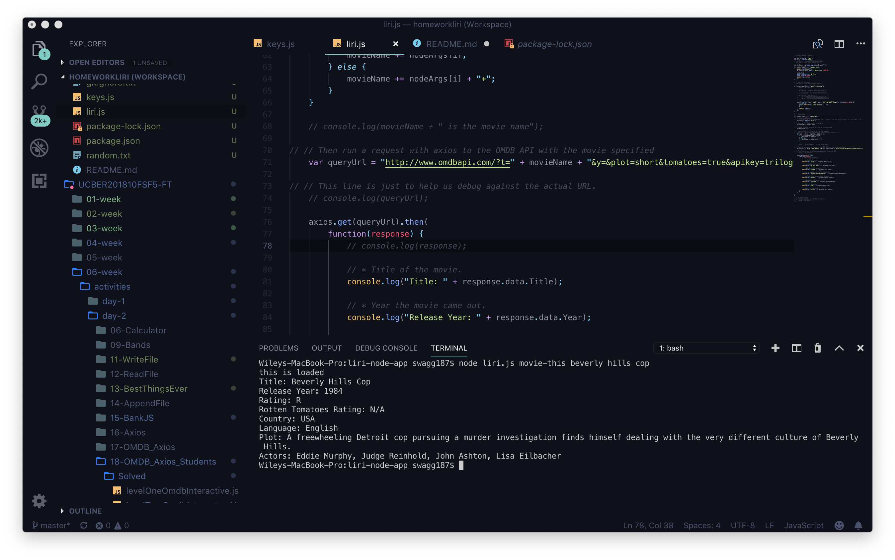

# liri-node-app

### Overview

This terminal application is supposed to let the user search for movies in the OMDB data base, search for songs in the Spotify datbase, search for upcoming concerts in the Bands in Town data base. As of writing this, my version of the app can only search the OMDB data base. The other functionalities I wasn't able to complete yet. To run this app, the user needs to  have node installed. The user has to download certain things into a json package into the root file of the app. These NPM "things" they need to have include: "axios", "bands in town", "node-spotify-api" and other things probably. I don't really totally understand this as you can probably tell, but I am doing my best here. Also its my birthday so I don't really feel like working too hard this evening. So maybe when I said I am doing my best I actually meant second or third best. But I do care. Like seriously care, I will go back and learn everything and update this.

### OMDB Search Function

If the user types: "node liri.js movie-this" followed by a movie title, this console app will search the OMDB.com data base for the title and return a heaping helping of information about the movie that was entered. The app will clevery dissect multiple-word titles and put the reformated title into a search URL which it then sends through the API call. 

As you can see above, I either don't know how to put an image in a markdown file, or you can see that this OMDB search functionality is totally working great.

### Spotify search function

It was supposed to be able to search spotify but I can't get the key in the .env file to work...? Help.

### Bands In Town search

Yeah this doesn't work either. Can't be bothered at the moment.

### "DO-IT" function

This one was weird. I gave up.